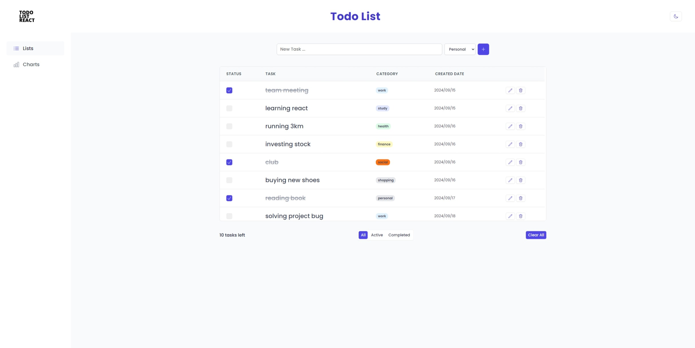
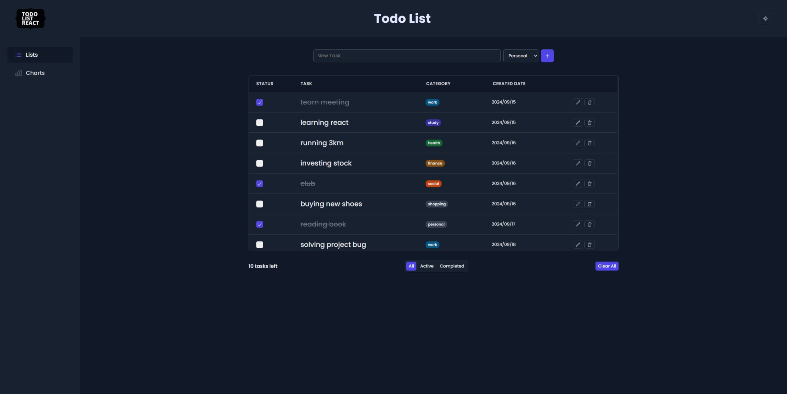
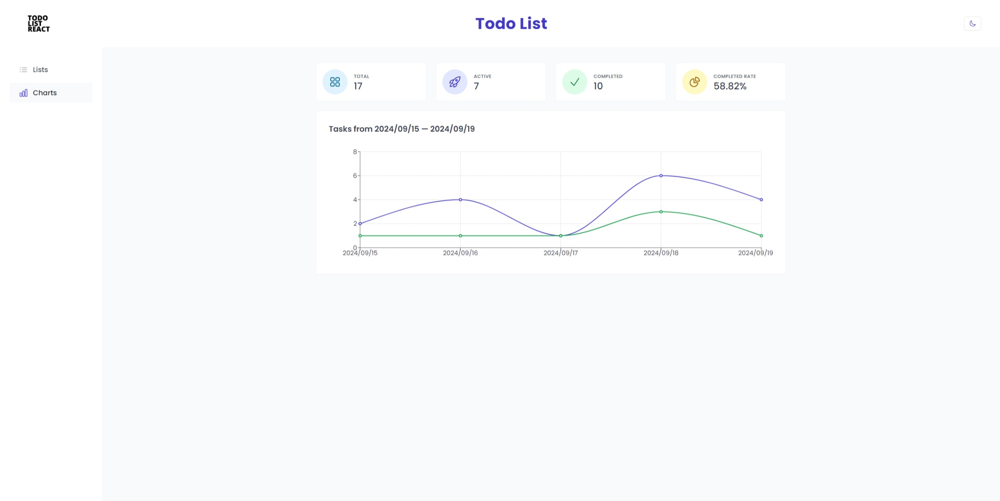
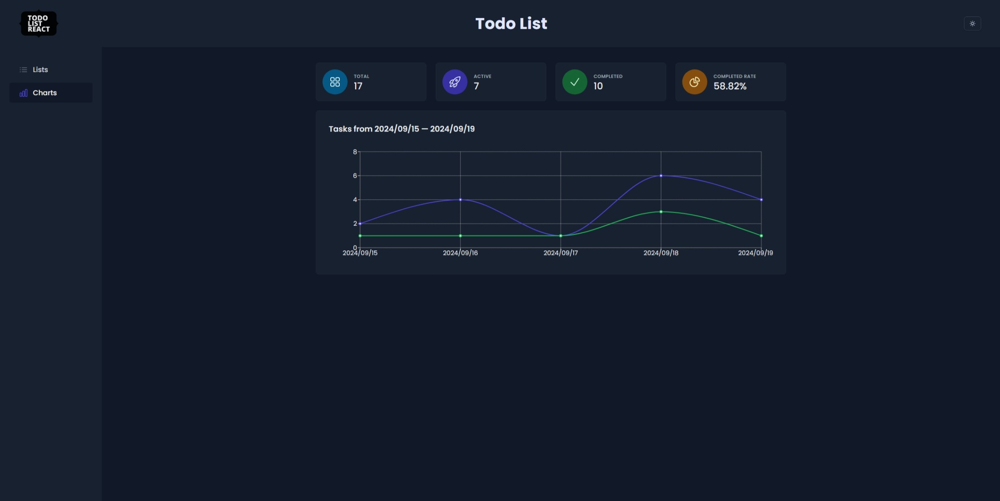

<p align='center'>
  <a href='https://todo-list-react-stevenhuang0604.vercel.app' target='_blank'>
    
  </a>
</p>

# Todo List React

A simple and feature-rich todo list application built with React.

## Screenshots






## Live Demo

You can try out the live demo of this project at: [https://todo-list-react-stevenhuang0604.vercel.app](https://todo-list-react-stevenhuang0604.vercel.app)

## Features

1. **Add Tasks**: Type your task and hit Enter or click the enter button to add it to the list.

2. **Mark as Completed**: Click the checkbox next to a task to mark it as completed.

3. **Delete Tasks**: Remove unwanted tasks by clicking the delete button.

4. **Edit Tasks**: Edit task details by clicking the edit button or double-clicking the task name.

5. **Clear All**: Remove all tasks at once with the "Clear all" button.

6. **Filter Tasks**: Easily browse all, active, or completed tasks using the provided filters.

7. **Sort by Date**: Organize your tasks by sorting them according to their creation date.

8. **Dark/Light Mode**: Switch between dark and light modes for comfortable viewing.

9. **Task Statistics**: View your task completion statistics at a glance.

10. **Task Creation Chart**: Visualize your task creation and completion rates with an integrated line chart.

## Tech Stack

- React
- React-Router
- Context API
- CSS modules

## Getting Started

To run this project locally:

1. Clone the repository:

   ```
   git clone https://github.com/stevenHuang0604/todo-list-react.git
   ```

2. Navigate to the project directory:

   ```
   cd todo-list-react
   ```

3. Install dependencies:

   ```
   npm install
   ```

4. Start the development server:

   ```
   npm run dev
   ```

5. Open your browser to view the app.

## Contributing

Contributions are welcome! Please feel free to submit a Pull Request.

## License

This project is open source and available under the [MIT License](LICENSE).
